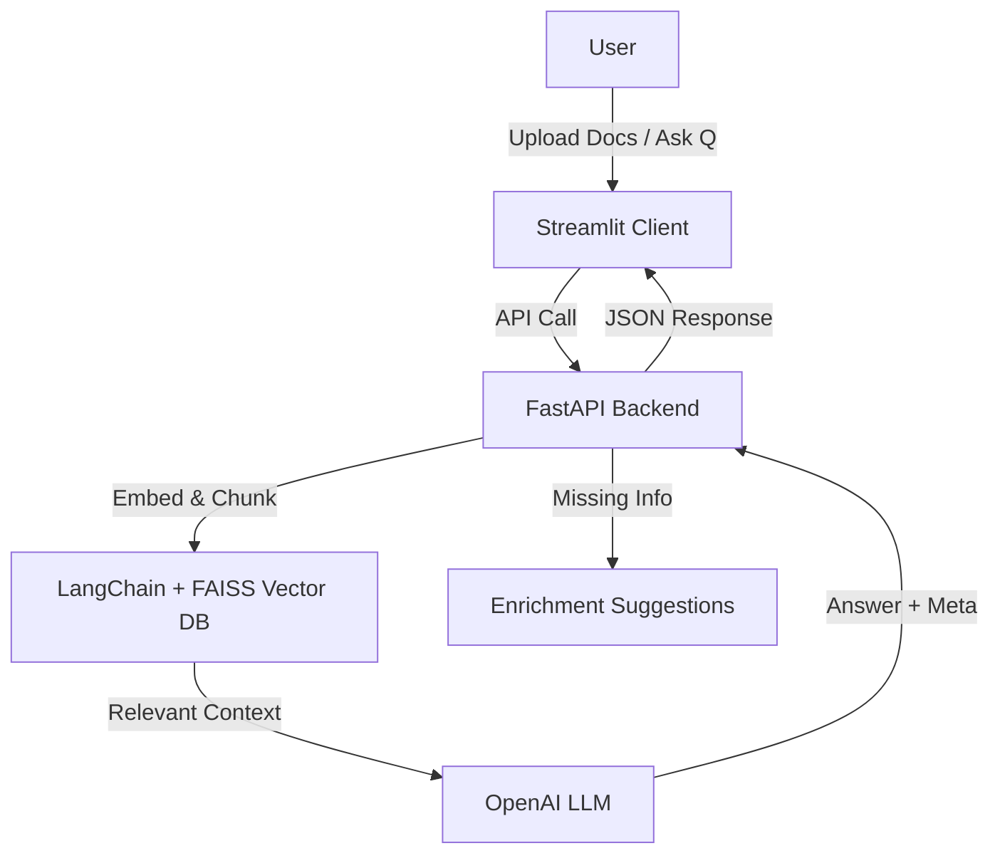

# 📚 AI-Powered Knowledge Base Search & Enrichment

An end-to-end **Retrieval-Augmented Generation (RAG)** system where users can upload or scrape documents, query them in natural language, and get **AI-powered answers**. The system also detects when answers are incomplete and suggests **knowledge base enrichment strategies**.  

This project was built as part of a **technical challenge** with a **24h time constraint** — so design trade-offs and optimizations are explicitly documented.

---

## ✨ Features

- **Document Ingestion**: Upload PDFs, DOCX, TXT, or ingest content from URLs.  
- **Chunking & Embeddings**: Uses LangChain’s `RecursiveCharacterTextSplitter` for robust document splitting.  
- **Vector Store**: FAISS as the local vector DB (persisted in `./data/faiss_index`).  
- **Natural Language Query**: Ask plain-language questions → AI retrieves relevant docs + generates an answer.  
- **Completeness Check**: Detects when retrieved context is insufficient.  
- **Enrichment Suggestions**: Provides strategies (e.g., “add definition of self-attention”) to strengthen the KB.  
- **Structured Output**: JSON with fields:  
  ```json
  {
    "answer": "...",
    "confidence": 0.85,
    "missing_info": "...",
    "enrichment_suggestion": "..."
  }
  ```  
- **Frontend (Streamlit)**: Clean, minimal UI for uploading docs, asking questions, and rating answers.  
- **Backend (FastAPI)**: REST API with endpoints for ingestion, query, and enrichment.  
- **Deployment Ready**:  
  - **Backend** → Dockerized + Render (persistent storage enabled)  
  - **Frontend** → Streamlit Cloud  

---

## 🏗️ Architecture



---

## ⚡ Tech Stack

- **Frontend**: Streamlit  
- **Backend**: FastAPI + Uvicorn  
- **Vector DB**: FAISS (local persistent)  
- **Frameworks**: LangChain, Pydantic v2  
- **LLM**: OpenAI GPT (configurable)  
- **Deployment**:  
  - Backend → Render (Docker + persistent disk)  
  - Frontend → Streamlit Cloud  

---

## 🚀 Getting Started (Local)

### 1. Clone Repo
```bash
git clone https://github.com/<your-username>/kb-rag.git
cd kb-rag
```

### 2. Create Virtual Env
```bash
python -m venv .venv
source .venv/bin/activate   # Linux/Mac
.venv\Scripts\activate      # Windows
```

### 3. Install Requirements
```bash
pip install -r requirements.txt
```

### 4. Setup Environment Variables
Create `.env` in the project root:
```env
OPENAI_API_KEY=your_openai_key
```

### 5. Run Backend
```bash
uvicorn app.main:app --reload --port 8000
```

### 6. Run Frontend
```bash
streamlit run client/app.py
```

---

## 🧪 Example API Usage

### Query Endpoint
```bash
POST http://localhost:8000/query
{
  "question": "What is self-attention?",
  "k": 3
}
```

### Response
```json
{
  "answer": "Self-attention is a mechanism in transformers that enables...",
  "confidence": 0.87,
  "missing_info": null,
  "enrichment_suggestion": null
}
```

---

## ☁️ Deployment Guide

### Backend → Render
1. Add `Dockerfile` and `render.yaml` (included in repo).  
2. Push repo to GitHub.  
3. On Render:  
   - New Web Service → Connect repo  
   - Add env var `OPENAI_API_KEY`  
   - Done → Backend hosted at `https://kb-api.onrender.com`  

### Frontend → Streamlit Cloud
1. Go to [Streamlit Cloud](https://streamlit.io/cloud)  
2. Deploy from GitHub repo  
3. Add `secrets.toml` with:
   ```toml
   OPENAI_API_KEY="your_openai_key"
   API_URL="https://kb-api.onrender.com"
   ```  

---

## ⚖️ Trade-Offs & Design Decisions

- **FAISS Local Storage**: Chosen to avoid external DBs (per requirement). For production, consider Pinecone/Qdrant/Weaviate.  
- **Render Deployment**: Provides free persistent storage for FAISS index.  
- **RecursiveCharacterTextSplitter**: Handles different content structures better than simple chunking.  
- **JSON Output**: Structured → easy to integrate with downstream apps.  
- **24h Constraint**: Focused on core RAG pipeline + completeness detection. Left out: advanced feedback loops, auto-enrichment with external APIs.  

---

## 🎥 Demo

- **Backend API** → Hosted on Render  
- **Frontend** → Hosted on Streamlit Cloud  
- **Video Demo** → [Loom link](https://www.loom.com/share/74a8eeb2aca0497596bb810cf811d768?sid=412764c6-f531-4d6b-bc17-aa1ef2c63eb0)  

---

## 🧭 Next Steps / Stretch Goals

- 🔄 Auto-enrichment: fetch missing info from Wikipedia or domain APIs.  
- ⭐ User ratings: integrate feedback loop into vector store.  
- 🛡️ Improve security: JWT auth for API.  
- 📊 Dashboard: Monitor queries, coverage, and enrichment progress.  

---

## 👨‍💻 Author

**Your Name**  
- GitHub: [@ayush1409](https://github.com/ayush1409)  
